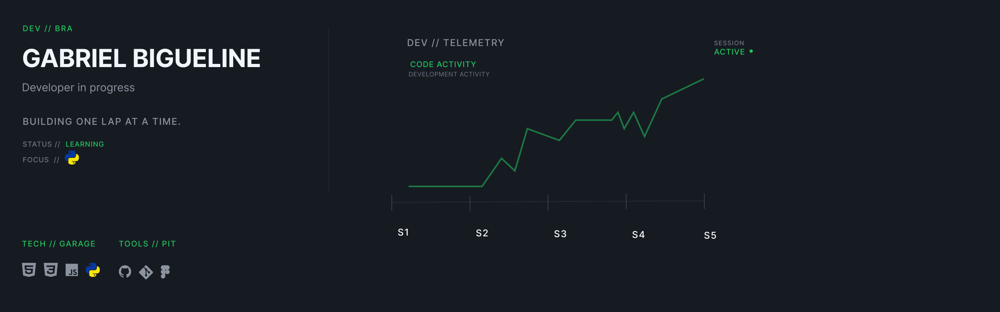

## 👋 Sobre mim

Sou estudante de **Análise e Desenvolvimento de Sistemas** e desenvolvedor em formação, transformando meus estudos em projetos práticos.

Atualmente, estou aprofundando meus conhecimentos em **Python**, desenvolvimento web e lógica de programação, enquanto construo projetos para praticar todo o ciclo de desenvolvimento — da ideia e implementação aos testes, debugging, Git e documentação.

> **Building one lap at a time.** 🏎️

## 🏁 Projetos em destaque

### 🔗 Gerador de Links

Meu primeiro projeto web, desenvolvido para praticar **HTML, CSS e JavaScript**, trabalhando responsividade, manipulação do DOM e alternância entre tema claro e escuro.

[🔎 Ver projeto no GitHub](https://github.com/bigueline/gerador-de-links)

### 🏋️ FitLife

Sistema de gerenciamento de alunos de academia desenvolvido com **HTML, CSS e JavaScript**, com cadastro, busca, edição e exclusão de alunos, validações de dados e persistência utilizando LocalStorage.

O projeto também passou por etapas de **UI/UX no Figma**, responsividade para desktop e mobile, testes e debugging.

[🔎 Ver projeto no GitHub](https://github.com/bigueline/FitLife) • [🌐 Acessar projeto](https://bigueline.github.io/FitLife/)

## 📫 Vamos nos conectar

LinkedIn: https://www.linkedin.com/in/gabriel-bigueline-henrique/
